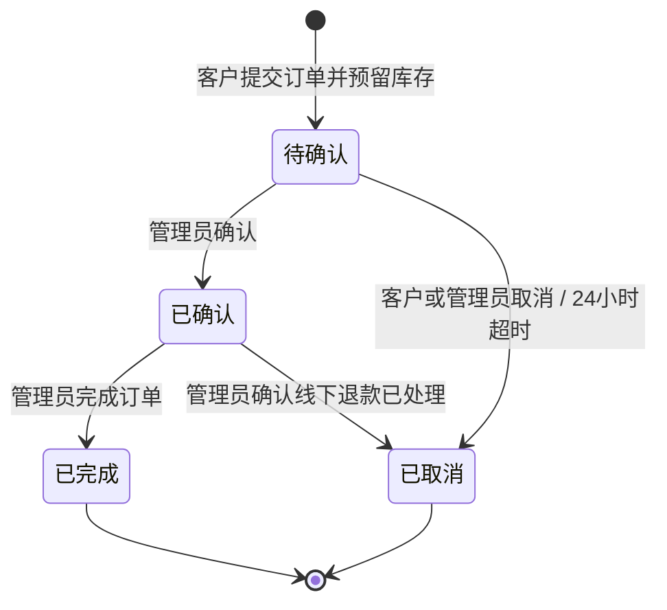

# 命理饰品商城一期产品需求文档（PRD）

## 1. 文档信息

| 项目 | 内容 |
| --- | --- |
| 文档版本 | v1.0 |
| 当前状态 | 需求已确认，可进入设计与开发 |
| 产品形态 | 面向客户的响应式 Web 商城 + 独立 Web 管理后台 |
| 一期业务 | 水晶手串、佛珠及相关饰品的展示、购买意向、库存与订单管理 |
| 交易方式 | 微信等站外渠道人工确认价格、转账、退款及履约 |

## 2. 产品概述

本项目是一个面向水晶手串、佛珠及相关饰品的 Web 商城，包含商城前台和管理后台。

商城前台允许公众浏览商品。客户需要注册并登录后才能通过“立即购买”提交订单。订单用于记录客户的购买意向、商品选择和库存预留，不代表已经付款或成交。最终价格、付款、退款、收货地址和履约细节均由客户与商家通过微信等站外渠道确认。

管理后台用于维护商品、可售规格、参考价、库存和订单。管理员可以确认、完成或取消订单，但系统不接入支付、退款或物流平台，也不判断站外付款和退款是否成功。

一期暂不实现算命、八字分析或智能推荐；商品与命理能力的结合留待后续迭代。

## 3. 一期目标

1. 建立任何访客都可以浏览的响应式 Web 商城。
2. 支持客户手机号注册、登录和登录后立即购买。
3. 支持运营人员维护商品、可售规格、参考价、上下架状态和可售库存。
4. 支持订单从待确认、已确认到已完成或已取消的人工处理闭环。
5. 通过库存预留与超时释放避免超卖和长期无效占用。
6. 在下单后向客户提供当前有效的商家微信联系方式，引导双方完成站外交易。
7. 尽量减少平台保存的个人信息，不在一期收集收货地址或支付信息。

## 4. 一期明确不做

- 购物车、收藏和多商品合并结算。
- 在线支付、微信支付、支付宝、支付回调和自动对账。
- 平台退款、退款状态、退款凭证和退款回调。
- 收货地址管理、快递公司、物流单号和物流轨迹。
- 商品筛选器、个性化推荐和命理推荐。
- 算命、八字、生肖或星座分析。
- 优惠券、积分、会员等级和营销活动。
- 多管理员、角色权限和管理员账户管理。
- 内容社区、直播、分销和供应商系统。

## 5. 用户与账户

### 5.1 访客

- 无需登录即可访问首页、分类、商品列表、搜索和商品详情。
- 不可以提交订单或查看客户中心。
- 点击“立即购买”时进入客户登录或注册流程。

### 5.2 商城客户

- 使用手机号注册账户。
- 注册时通过短信验证码验证手机号所有权并设置密码。
- 日常使用手机号和密码登录。
- 通过短信验证码找回密码。
- 登录后可以立即购买、查看自己的订单和取消待确认订单。
- 只能查看本人订单，不能访问其他客户的数据。

### 5.3 后台管理员

- 一期只有一个管理员账户。
- 使用独立的后台入口、用户名和密码登录。
- 管理员账户与商城客户账户相互独立。
- 一期不提供新增管理员、角色或权限配置页面。
- 管理员负责商品、库存、客户和订单管理。

### 5.4 客户账户管理规则

- 管理员可以查看客户手机号、注册时间、账户状态和订单记录。
- 管理员可以启用或停用客户账户。
- 停用账户不能登录或创建新订单，但历史订单继续保留。
- 管理员不能查看客户密码。
- 一期不允许管理员直接删除客户或任意修改客户密码。

## 6. 商品与可售规格模型

### 6.1 商品

商品是面向客户展示的一组饰品信息，至少包含：

- 商品编号。
- 商品名称。
- 商品分类。
- 主图和轮播图。
- 商品介绍和详情内容。
- 后台排序值。
- 草稿、上架或下架状态。
- 创建时间和更新时间。

商品本身不单独维护价格和库存，价格与库存只属于可售规格。

### 6.2 可售规格

每个商品至少包含一个可售规格。运营人员手工创建可售规格，一期不提供多维规格矩阵或自动组合器。

每个可售规格包含：

- 规格编号。
- 自由组合名称，例如“紫水晶 / 8mm / 16cm”。
- 参考单价。
- 库存总量。
- 已预留数量。
- 可售库存。
- 启用或停用状态。

可售库存的计算规则为：

```text
可售库存 = 库存总量 - 已预留数量
```

### 6.3 前台参考价展示

- 商品只有一个启用规格时，展示该规格参考价。
- 多个启用规格价格相同时，展示唯一参考价。
- 多个启用规格价格不同时，展示最低参考价或参考价格区间。
- 所有金额均标注为参考信息，最终价格以商家站外确认为准。

### 6.4 商品状态和库存状态

- 草稿商品只在后台可见。
- 下架商品不在前台展示，也不能创建新订单。
- 上架且至少一个启用规格有可售库存时，前台显示“有货”。
- 上架但所有启用规格的可售库存均为 0 时，前台显示“已售罄”。
- 售罄商品继续展示，但“立即购买”不可用。
- 前台不显示具体库存数量。

### 6.5 删除与停用

- 从未产生订单的草稿商品及其规格可以物理删除。
- 已经产生订单的商品不能物理删除，只能下架。
- 已经产生订单的可售规格不能物理删除，只能停用。
- 停用规格不能用于新订单，但不影响历史订单和商品快照。
- 已被商品使用的分类不能物理删除，只能停用。

## 7. 商城前台需求

### 7.1 首页

- 展示商城名称、品牌信息和主要导航。
- 按后台排序值展示商品；排序值相同时按最新上架时间排列。
- 提供商品分类入口。
- 不提供独立的“推荐商品”机制或自动推荐算法。

### 7.2 分类和商品列表

- 按分类浏览已上架商品。
- 按商品名称搜索。
- 商品卡片展示主图、名称、参考价和“有货/已售罄”。
- 一期不提供材质、颜色、价格等组合筛选器。

### 7.3 商品详情

- 展示名称、主图、轮播图和详情内容。
- 展示可选的启用规格和对应参考价。
- 根据所选规格显示“有货”或“已售罄”。
- 支持选择购买数量，默认数量为 1，不得超过可售库存。
- 只提供“立即购买”，不提供“加入购物车”。
- 明确提示参考价和最终价格以商家确认为准。
- 已售罄或已下架商品不能进入订单提交环节。

### 7.4 登录拦截与返回

- 未登录访客点击“立即购买”时跳转到登录或注册页。
- 登录成功后返回原商品及已选择的规格和数量。
- 已登录客户直接进入订单确认页。

### 7.5 订单确认页

- 展示商品名称、图片、所选规格、数量、参考单价和参考金额。
- 联系电话必填，默认带入客户账户手机号，允许客户在订单中修改。
- 微信号和客户备注可选。
- 不收集收货人姓名、收货地址、身份证或支付信息。
- 明确提示最终价格、地址、付款及交付方式需要与商家私聊确认。
- 提交时再次校验商品上架状态、规格状态和可售库存。
- 防止重复点击或重复请求创建多张订单。

### 7.6 下单成功页

- 展示订单编号和“待确认”状态。
- 展示当前有效的商家微信号、微信二维码和联系说明。
- 引导客户主动添加商家微信并发送订单编号。
- 提供“查看订单”和“继续浏览商品”入口。
- 不展示“已付款”“待付款”或“退款”等平台无法确认的文案。

### 7.7 我的订单

- 仅登录客户可访问。
- 列表展示订单编号、商品摘要、参考金额、当前状态和创建时间。
- 订单详情展示商品快照、数量、联系电话、可选微信号、备注和当前商家联系方式。
- 商家联系方式始终使用后台当前有效配置，不保存和展示旧二维码快照。
- 客户可以取消待确认订单。
- 已确认订单不提供取消或退款按钮，客户需要联系管理员处理。

## 8. 订单模型与生命周期

### 8.1 订单含义

订单是购买意向和商品预留记录，不是支付单、成交记录或物流单。订单保存下单时的商品快照和参考价，但最终价格与履约内容以站外沟通为准。

一张订单只包含：

- 一个可售规格。
- 一个购买数量。
- 对应的商品和参考价快照。

### 8.2 当前订单状态

订单只维护一个当前状态字段，不拆分支付、退款、物流或售后状态。

| 状态 | 含义 | 是否终态 |
| --- | --- | --- |
| 待确认 | 客户已提交，库存已预留，等待管理员确认 | 否 |
| 已确认 | 管理员接受继续处理；不代表已经付款 | 否 |
| 已完成 | 管理员确认站外交易和商品交付已经结束 | 是 |
| 已取消 | 交易终止，必要的站外退款已处理完毕 | 是 |

后台可以调整状态的显示名称、颜色和排序，但不能新增、删除或改变四个状态的业务含义。

### 8.3 允许的状态流转



- 客户只能取消待确认订单。
- 管理员可以取消待确认或已确认订单。
- 已确认订单取消前，管理员负责在线下处理必要退款。
- 已完成和已取消订单不可重新打开。
- 状态变更记录是审计日志，不是第二套订单状态。

### 8.4 订单信息

- 订单 ID 和唯一订单编号。
- 客户 ID。
- 商品及可售规格快照。
- 下单时参考单价、数量和参考金额。
- 联系电话。
- 可选微信号和客户备注。
- 当前订单状态。
- 管理员后台备注。
- 创建时间、确认时间、完成或取消时间及更新时间。

## 9. 库存预留规则

### 9.1 创建订单

- 客户提交订单时立即预留所选规格库存。
- 预留与订单创建必须作为不可分割的业务操作。
- 可售库存不足时订单创建失败，库存不得变为负数。
- 创建成功后订单进入待确认状态。

### 9.2 超时释放

- 待确认订单创建满24小时仍未被管理员确认时，系统自动将其设为已取消。
- 自动取消必须释放对应的库存预留。
- 已确认订单不执行24小时自动取消。

### 9.3 取消订单

- 待确认订单由客户或管理员取消时，释放全部预留库存。
- 已确认订单由管理员取消时，释放全部预留库存。
- 同一订单只能释放一次库存，重复请求不得增加库存。

### 9.4 完成订单

- 管理员将订单设为已完成时，预留数量转为最终售出数量。
- 完成操作不得再次减少可售库存，因为库存已经在订单创建时被预留。

### 9.5 库存调整记录

后台每次增加、减少、修正、预留、释放或售出库存时，记录：

- 变更前数量。
- 变更数量。
- 变更后数量。
- 变更类型和原因。
- 关联订单编号（如适用）。
- 操作来源和时间。

一期只有一个管理员账户，但仍保留库存变更记录以便追溯。

## 10. 管理后台需求

### 10.1 后台登录

- 使用独立后台入口。
- 未登录访问后台页面时跳转到后台登录页。
- 登录失败提示不得泄露管理员账户是否存在。
- 支持安全退出和基础登录失败限流。

### 10.2 商品分类管理

- 新增、编辑、启用、停用和排序分类。
- 配置分类名称和可选图片。
- 已被商品使用的分类不能物理删除。

### 10.3 商品与规格管理

- 新增、编辑、复制、查看、上架和下架商品。
- 保存商品草稿。
- 上传主图、轮播图并编辑详情内容。
- 手工创建、编辑、启用和停用可售规格。
- 为每个可售规格维护参考价和库存。
- 草稿且从未产生订单的商品可以删除。

### 10.4 库存管理

- 按商品和规格查看库存总量、已预留数量和可售库存。
- 支持增加、减少和修正库存总量。
- 库存总量不得低于已预留数量。
- 查看库存变更记录。
- 前台始终只显示有货或已售罄。

### 10.5 订单管理

- 按订单编号、客户手机号、商品名称和当前状态搜索订单。
- 查看商品快照、参考金额、客户联系方式和备注。
- 将待确认订单设为已确认或已取消。
- 将已确认订单设为已完成或已取消。
- 填写仅管理员可见的后台备注。
- 查看状态变更记录和库存关联记录。
- 不在后台记录支付成功、退款中或物流状态。

### 10.6 客户管理

- 查看客户列表、账户状态、注册时间和订单记录。
- 启用或停用客户账户。
- 不查看密码、不直接删除客户、不替客户修改密码。

### 10.7 商家联系方式配置

- 配置当前商家微信号。
- 上传当前微信二维码。
- 配置下单成功后的联系说明和可选工作时间。
- 商家微信二维码只在下单成功页和订单详情中展示，不在首页或商品详情中公开。
- 更新后立即应用于下单成功页和所有订单详情。
- 不在历史订单中固化旧微信二维码。

## 11. 核心数据实体

### 11.1 客户账户

- 客户 ID。
- 已验证手机号。
- 密码哈希。
- 启用或停用状态。
- 注册时间、最近登录时间和更新时间。

### 11.2 管理员账户

- 管理员 ID。
- 登录用户名。
- 密码哈希。
- 最近登录时间和更新时间。

### 11.3 商品与可售规格

- 商品基本信息及上下架状态。
- 可售规格名称、参考价、库存总量、已预留数量和启停状态。
- 商品与规格创建、更新时间。

### 11.4 订单与订单快照

- 订单基本信息、客户关联、联系电话和可选备注。
- 当前订单状态。
- 商品名称、图片、规格名称、参考单价、数量和参考金额快照。
- 关键状态发生时间。
- 状态变更记录。

### 11.5 配置与审计记录

- 当前商家微信配置。
- 商品分类和展示排序。
- 库存变更记录。
- 订单状态变更记录。

## 12. 隐私与安全要求

### 12.1 隐私范围

- 注册前展示用户协议和隐私政策，并要求客户主动同意。
- 系统仅保存业务必要的手机号、可选微信号和客户备注。
- 一期不保存收货地址、身份证、银行卡、支付凭证或聊天记录。
- 密码不得明文保存或展示。
- 日志不得记录密码、短信验证码等敏感认证信息。

### 12.2 认证安全

- 客户注册和找回密码必须验证短信验证码。
- 短信验证码具有有效期、发送频率和尝试次数限制。
- 密码使用可靠的单向哈希算法保存。
- 客户端和后台登录接口需要基础防暴力尝试措施。
- 客户端和后台会话相互隔离。

### 12.3 数据访问

- 客户只能访问自己的账户和订单。
- 后台接口必须验证管理员身份。
- 停用客户不能创建新会话或订单。
- 商品、库存和订单的关键写入操作进行服务端校验。

## 13. 非功能要求

### 13.1 兼容性与易用性

- 前台适配常见电脑和手机浏览器。
- 后台优先适配电脑浏览器，并保证常用操作在平板宽度下可用。
- 登录后返回购买上下文，避免客户重新选择规格。
- 表单错误信息明确，并保留已经填写的有效内容。

### 13.2 数据一致性

- 订单创建与库存预留使用同一事务或具备等价的原子性保证。
- 取消与库存释放必须幂等。
- 完成与库存售出转换必须幂等。
- 并发下单不得导致可售库存为负数。
- 商品后续修改不影响历史订单快照。

### 13.3 可追溯性

- 库存变更和订单状态变更必须保留时间、来源和前后值。
- 自动超时取消需要标记为系统操作。
- 管理员手工操作需要标记为管理员操作。

## 14. 一期验收标准

1. 访客能够浏览分类、商品列表、名称搜索和商品详情。
2. 未登录访客点击立即购买时进入登录或注册流程，登录后返回原购买上下文。
3. 客户能够使用短信验证手机号完成注册，并使用手机号和密码登录。
4. 客户能够通过短信验证码找回密码。
5. 一张订单只能包含一个可售规格和一个购买数量，不存在购物车。
6. 下单页面只要求联系电话，微信号和备注可选，不收集收货地址。
7. 提交订单后立即预留库存，订单进入待确认状态。
8. 并发下单不会导致库存为负数或超卖。
9. 待确认订单24小时未确认时自动取消并只释放一次库存。
10. 客户只能取消待确认订单，不能取消已确认订单。
11. 管理员能够将待确认订单设为已确认或已取消。
12. 管理员能够将已确认订单设为已完成或已取消。
13. 已完成和已取消订单不能重新打开。
14. 已取消订单正确释放库存，已完成订单正确转为最终售出。
15. 前台只显示有货或已售罄，不显示具体库存数量。
16. 售罄商品继续展示，但不能提交订单。
17. 商品只有可售规格拥有参考价和库存，商品不存在第二套价格或库存。
18. 下单成功页和订单详情始终展示当前有效的商家微信信息。
19. 订单及页面不显示平台已经付款、退款或发货等无法确认的状态。
20. 修改商品名称、图片、规格或参考价后，历史订单快照保持不变。
21. 管理员能够查看、启用或停用客户账户，但不能查看密码或删除客户。
22. 已产生订单的商品和规格不能物理删除。
23. 用户协议和隐私政策在注册前可查看并需要客户主动同意。
24. 所有库存与订单状态变更都能够追溯到操作来源和时间。

## 15. 后续迭代方向

- 收货地址、物流和售后管理。
- 在线支付、支付回调和自动退款。
- 购物车、收藏、筛选器和多商品订单。
- 多管理员、角色权限和操作审批。
- 命理标签、八字分析和商品推荐。
- 优惠券、积分、会员和营销能力。
- 经营数据看板和更细粒度的审计能力。
